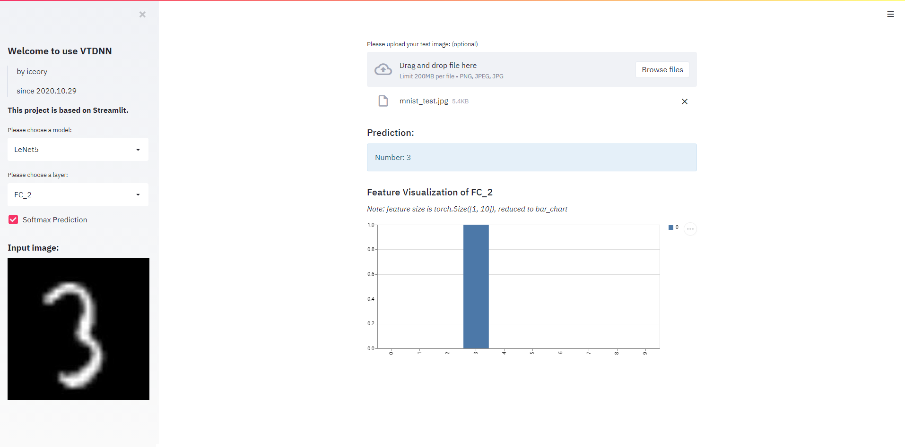
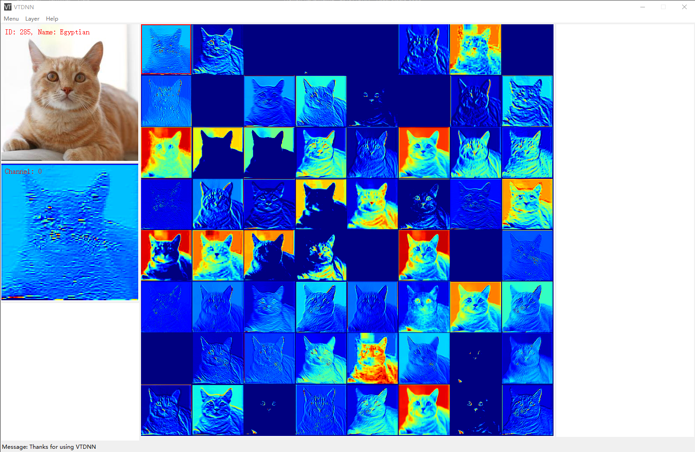

## README
> by iceory
>
> since 2020.10.29

### Introducion

VTDNN (Visualization Tool for Deep Neural Networks) is a tool for visualizing features and predictions of deep neural networks, we provide web-ui and tkinter-ui for users.

### How to use

#### Web UI

Run the following command

```bash
streamlit run app.py
```
Then open the link on browser



#### Tkinter-UI

Run the following command

```bash
python main.py
```

Then you will get



### Requirements

```
os: windows10

python packages:
pytorch>=0.4 and torchvision
thinter (if use tkinter-ui)
numpy
matplotlib
PIL
streamlit (if use web-ui)
pydot
```

